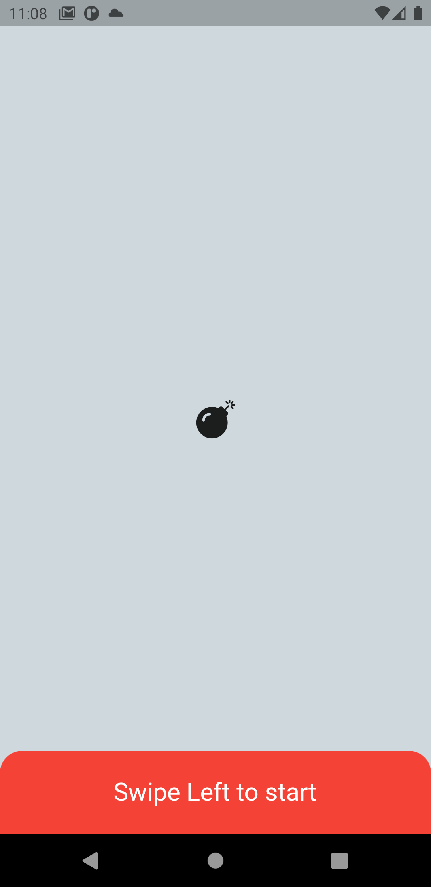
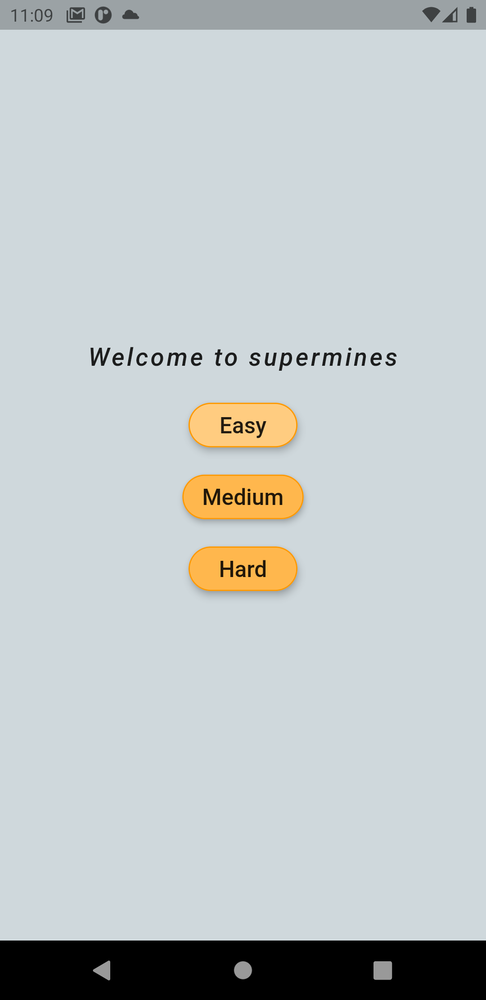
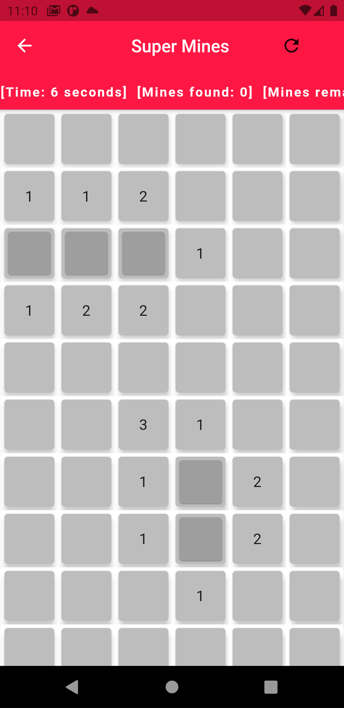
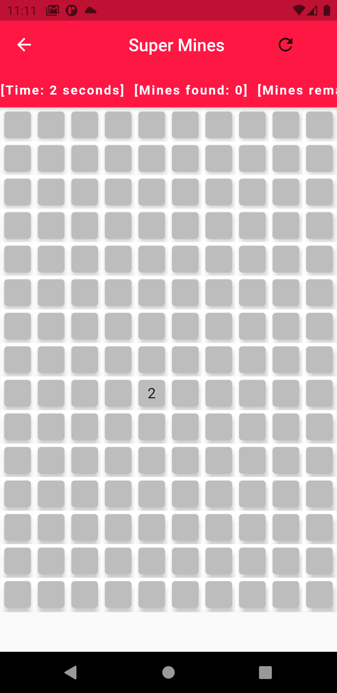
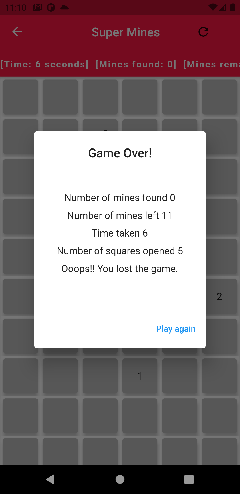

# supermines

Took up supermines app for hiring challenge at OCG and completed in a day.

## Description

Simple supermines game that I have played a lot on windows 7. We can choose between easy, medium and hard and just start playing. Once we tap on a tile that has bomb, game over. Based on difficulty level the number of tiles and bomb count will be increased. We can also look at our score, stopwatch for how long we have been playing the game, mines remaining, mines found on longpress pinning flag and so on.

## Home

## Select Difficulty

## Easy mode

## Hard mode

## Game over

